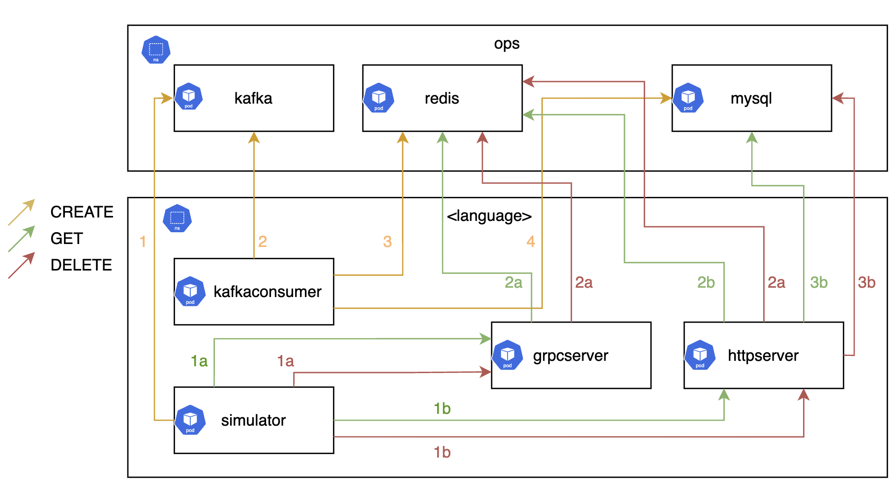

# OpenTelemetry Kubernetes Demo

This repo is dedicated to demonstrate OpenTelemetry instrumentation for different programming languages with various communication protocols as well as instrumentation for the underlying cluster itself.

## Introduction

This repo is meant to cover most common use-cases (such as HTTP client/server or Kafka producer/consumer) and instrument them with most up-to-date OpenTelemetry conventions and SDKs. Moreover, the repo aims to monitor the underlying Kubernetes cluster using OpenTelemetry collectors with well known Prometheus standards and with various collector features.

All the collected telemetry data can be sent to any observability backend. That being said, the repo mainly focuses on New Relic, though you are more than welcome to bring your own monitoring for your desired backend!

OpenTelemetry not only aims to provide vendor-agnostic instrumentation but language-agnostic as well. This means that whatever programming language you are using, the logic of the applications and the interactions between the applications should generate the same telemetry data in sense of semantic conventions _(example exception: runtime metrics)_. And that is exactly the primary goal of this repo!

## Prerequisites

### Required

- Git
- Docker
- Kubectl
- Helm

### Optional

- Docker Hub account for local development
- Kind for local development
- Azure account & CLI for AKS
- Terraform
- Golang SDK 1.21 for local development

## Architecture

The repo replicates a commonly preferred organizational DevOps structure:

- Central operations team responsible of cluster provisioning as well as maintenance. They provide the necessary platform for the developers to run their workloads upon.
- Developer teams responsible of developing the actual business applications.

It can be stated that the tasks of individual teams are sort of loosely decoupled from each other. In this repo, every programming language stands for a different `devteam` where the central maintanence team is referred as the `opsteam` and responsible for the cluster components and the common resources which the `devteams` use (Kafka, MySQL). The `opsteam` uses the `ops` namespace and the `devteams` use their `<language>` namespace (e.g. `golang`) for their applications.

The current business logic is simple. Every team has 3 components: `simulator`, `kafkaconsumer` and `httpserver`. As it can be seen the diagram below, the `simulator` publishes a message (from its own namespace) to the `kafka` cluster (in the `ops` namespace). This stands for a `CREATE` request which is meant to store a random data in the `mysql` database (in the `ops` namespace). This is done via the `kafkaconsumer` which consumes the message from the `kafka` cluster and stores the data in the `mysql` database. Meanwhile, the `simulator` also performs `GET` and `DELETE` requests against the `mysql` database via the `httpserver`.



That being said, the telemetry data which is generated from the applications within the `<language>` namespaces are sent to the `otelcollectors` in the `ops` namespace which will send the data to your observability backend. This is depicted in the diagram below.


## Cluster provisioning

Although Kubernetes is provider agnostic, the repo aims to run the environment in all major cloud provider Kubernetes offerings in an automated manner. To set up your cluster in your desired cloud provider, follow along the docs belows:

- [AWS](./infra/cluster/aws/) (to be implemented)
- [Azure](./infra/cluster/azure/)
- [GCP](./infra/cluster/gcp/) (to be implemented)

## Applications

Every application that is used in this repo is built and deployed by Helm charts via Github workflows. In order to accomplish full automation, dedicated naming conventions and folder structures are used:

```
apps/
  <languages>/
    <applications>
    Dockerfile
infra/
  helm/
    <charts>/
      chart/
      deploy.sh
```

`<languages>` stands for:

- [.NET](./apps/dotnet/) (to be implemented)
- [Golang](./apps/golang/)
- [Java](./apps/java/) (to be implemented)
- [Javascript](./apps/javascript/) (to be implemented)
- [Python](./apps/python/) (to be implemented)

`<applications>` stands for:

- (commons library)
- httpserver
- kafkaconsumer
- simulator

`<charts>` stands for:

- [cert-manager](/infra/helm/cert-manager)
- [httpserver](/infra/helm/httpserver/)
- [kafka](/infra/helm/kafka/)
- [kafkaconsumer](/infra/helm/kafkaconsumer/)
- [mysql](/infra/helm/mysql/)
- [otelcollector](/infra/helm/otelcollector/)
- [oteloperator](/infra/helm/oteloperator/)
- [simulator](/infra/helm/simulator/)

### Build & Push

You can refer to [this](/apps/README.md) documentation for building and pushing the images. You can either use the automated way per Github workflows or the local option for faster development.

### Deploy

You can refer to to [this](/infra/helm/README.md) documentation for deploying them onto your cluster. You can either use the automated way per Github workflows or the local option for faster development.

### Monitor

You can find necessary documentation for each observability backend to monitor the cluster and the apps:

- [New Relic](/monitoring/newrelic/)
